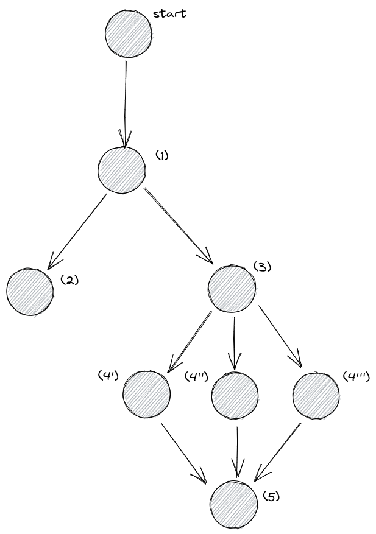

# AIRFLOW EXAM

### Introduction

This repository includes a containered version of airflow (provided by the DataScientest team) and the DAG file that I coded to build a sample pipeline to extract weather data, train three sample models and select the most performant one.

In order to use the pipeline, it is necessary to create an account and obtain an api key from [OpenWeatherMap](https://openweathermap.org/). 

### Instructions to use the repository

- Create the folders logs, plugins, raw_file and clean_data : `mkdir ./logs ./plugins ./raw_files ./clean_data`
- Init the containers : `docker-compose up -d`
- Go to airflow dashboard *([localhost:8080](http://localhost:8080))* and add two variables :
    - *api-key* : your key from [OpenWeatherMap](https://openweathermap.org/)
    - *cities* : comma-separated list of cities (i.e. `paris,london,washington`)
- From the airflow dashboard, look for the weather_dag DAG (tags : `datascientest`, `weather`) and activate it
- After some minutes, you will find :
    - The raw json data generated every minute at /raw_data
    - The clean csv data generated for the last 20 minutes (data.csv) and the whole data (full_data.csv) at /clean_data  
    - The model pircked at /clean_data/model.pckl. 

All the data will be updated every minute.

### Folders

**dags** : The folder containing the airflow DAG

### Author

Marcello CACIOLO
